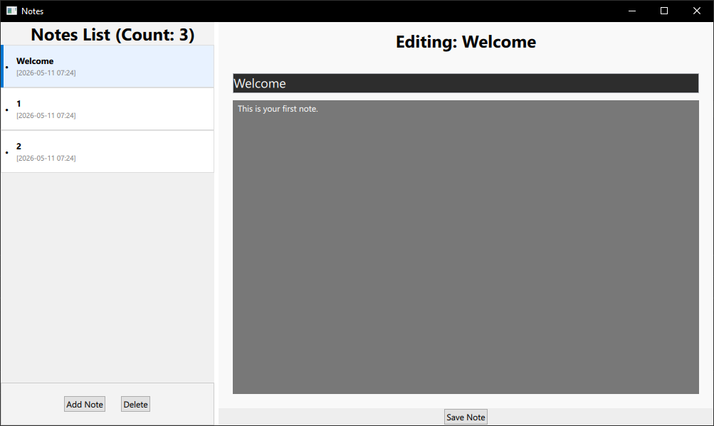

# Notes Editor

## Build 

1. Install Qt 6.10  
Download the Qt Online Installer from the official Qt website.  

Log in and select Qt 6.10 from the package list.  

Windows users: Ensure you check the MSVC 2022 64-bit component.  

2. Open the Project
You can use either Qt Creator (recommended) or Visual Studio:

Qt Creator:

Open Qt Creator and select File > Open File or Project.

Select the CMakeLists.txt file in the root directory.

When prompted, select the Qt 6.10 MSVC2022 (or Desktop) Kit.

Visual Studio:

Ensure you have the Qt Visual Studio Tools extension installed.

Open Visual Studio and choose Open a local folder.

Select the project root. Visual Studio will automatically detect the CMake configuration.

3. Build and Debug
Qt Creator: * Press Ctrl + R to Build and Run.

Press F5 to Start Debugging.

Visual Studio: * Select appNotes.exe as the startup item in the toolbar.

Press F5 to build and launch with the debugger.